# Cheap PCB story

Assuming that you're a hardware hacker with full passionate about to making the new product and you dont want to build your own factory by tweaking around the [soldering workbench](https://github.com/pcbarts/vaporphaseone) or [PnP psychopunk machine](https://github.com/ottoragam/SimplePnP). It's likely you're end up somewhere( Asia: Shenzhen/Hongkong/Vietnam/etc, EU: Estonia/Germany/Sweden/etc, Americas: New Jersey/Mexico City/etc) to fit your need due to the trend of regional supply chain. You may encounter some problems no matter how the supply chain was formed. We'll share what've been through the general problem in the hacking journey. We select the stm32 based system because it's easy to implement the interfaces of IO, USB and a serial port programming circuit which is compatible with stm32-vserprog (SPI flash memory programmer).

We use [Kicad](https://docs.kicad.org/) as design tool and takes a several versions to achieve the current version. As each revision has been released with this document, hope it can be helpful to you in a way or another.


## Unit

### Length

Imperial unit system is heavily used in the PCB design, such as: package size of resistors and capacitors, wiring width, wiring spaceing, etc. The main commonly used imperial units are: ft, inch and mil. Noted the conversion: `1ft = 12inch = 12000mil = 304.8mm`

### Mass

When the wiring thickness is expressed by PCB, the unit of oz/ft<sup>2</sup> is used. The ft is the length unit mentioned above, and ft<sup>2</sup> is the area unit. oz is the mass unit ounce. Commonly used mass units in imperial are: lb, oz, dr. The conversion: `1lb = 16oz = 256dr = 453.59237g`

**tips** : Kicad provides a program pcb_calculator for calcuation: linear regulator parameters, wiring width, wiring spacing, etc.

## Resistors and capacitors

Resistors and capacitors have a three-digit or four-digit identification method, the unit of capacitance is pF, and the unit of resistance is Ω.

When the identifications are all numbers, the last digit identifies the power of 10. Here are some examples:

Identify the capacitors

 * 510  -> 51*10<sup>0</sup>pF=51pF
 * 512  -> 51*10<sup>2</sup>pF=5.1nF
 * 1000 -> 100*10<sup>0</sup>pF=100pF
 * 1002 -> 100*10<sup>2</sup>pF=10nF

Identify the resistors

 * 510  -> 51×10<sup>0</sup>Ω=51Ω
 * 512  -> 51×10<sup>2</sup>Ω=5.1KΩ
 * 1000 -> 100×10<sup>0</sup>Ω=100Ω
 * 1002 -> 100×10<sup>2</sup>Ω=10KΩ

For some small resistors, there are the following identification methods

 * R10  -> 0.1Ω
 * 5R1  -> 5.1Ω
 * 0R10 -> 0.1Ω
 * 5R10 -> 5.1Ω


## Package of SMD resistors and SMD capacitors

SMD resistors and SMD capacitors have standardized package. The package is identify with 4 digits (two digits for length and two digits for width), with imperial and metric identify methods.

The package size diagram is as follows:


The relationship between size and package is as follows:

| package(imperial/metric) | l(inch/mm) | w(inch/mm) | h(inch/mm) |
|--------------------------|------------|------------|------------|
| 0201/0603                | 0.024/0.6  | 0.012/0.3  | 0.01/0.25  |
| 0402/1005                | 0.04/1.0   | 0.02/0.5   | 0.014/0.35 |
| 0603/1608                | 0.06/1.55  | 0.03/0.85  | 0.018/0.45 |
| 0805/2012                | 0.08/2.0   | 0.05/1.2   | 0.018/0.45 |
| 1206/3216                | 0.12/3.2   | 0.06/1.6   | 0.022/0.55 |
| 1210/3225                | 0.12/3.2   | 0.10/2.5   | 0.022/0.55 |
| 1812/3246                | 0.12/3.2   | 0.18/4.6   | 0.022/0.55 |
| 2010/5025                | 0.2/5.0    | 0.1/2.5    | 0.024/0.6  |
| 2512/6332                | 0.25/6.3   | 0.12/3.2   | 0.024/0.6  |

The schematic diagram of the pad is as follows:

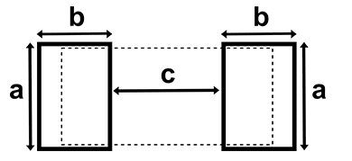

The relationship between pad size and package is as follows:

| package(imperial/metric) | a(inch/mm) | b(inch/mm) | c(inch/mm) |
|--------------------------|------------|------------|------------|
| 0201/0603                | 0.012/0.3  | 0.012/0.3  | 0.012/0.3  |
| 0402/1005                | 0.024/0.6  | 0.020/0.5  | 0.020/0.5  |
| 0603/1608                | 0.035/0.9  | 0.024/0.6  | 0.035/0.9  |
| 0805/2012                | 0.051/1.3  | 0.028/0.7  | 0.047/1.2  |
| 1206/3216                | 0.063/1.6  | 0.035/0.9  | 0.079/2.0  |
| 1812/3246                | 0.19/4.8   | 0.035/0.9  | 0.079/2.0  |
| 2010/5025                | 0.11/2.8   | 0.059/0.9  | 0.15/3.8   |
| 2512/6332                | 0.14/3.5   | 0.063/1.6  | 0.15/3.8   |

For SMD resistors, the package of the resistor is related to the power, and the corresponding relationship is as follows:

| package(imperial/metric) | power(watt)|
|--------------------------|---------|
| 0201/0603                | 1/20    |
| 0402/1005                | 1/16    |
| 0603/1608                | 1/10    |
| 0805/2012                | 1/8     |
| 1206/3216                | 1/4     |
| 1210/3225                | 1/2     |
| 1812/3246                | 1       |
| 2010/5025                | 3/4     |
| 2512/6332                | 1       |

**Tips**: The provider of resistor and capacitor in China usually requires imperial package.


## Model selection

The selection needs to consider the following factors:

- Diverse electronic components provided by EDA tool is low-hanging fruits
- Popularity, is it easy to buy?
- the price of components
- whether the size and packaging meet the design requirements


## Design

### Power supply circuit

#### Power supply protection circuit

In order to connect the power via USB interface, the protection of the USB power supply is needed.

1. Prevent circuit backflow and reverse connection
2. Prevent excessive current consumption

The current backflow prevention can be implemented by Schottky diode. Schottky diodes have the characteristics of small forward voltage drop and are suitable for this application scenario.

Schottky diode should be considered to be used in the higher priority. USB 2.0 is able to provide 5V 500mA power supply. We need a schottky diode with a reverse voltage greater than 5V and an overcurrent greater than 500mA. In Kicad, try 1N5817 (20V/1A). We found 1N5817WS with a smaller package in a local electronic store. We chose 1N5817WS because it'll make the layout more compacter. The next step is to confirm whether the electrical parameters are appropriate. The pressure drop of the conduction must be considered. We found the data sheet on the Internet. The current and voltage curve of this tube is shown in the figure below.

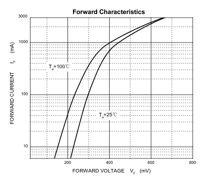

It can be easy spotted that the voltage drop of this diode is less than 0.4V at 500mA, which meets the requirements.

Then select the suitable fuse. The choice of self-recovery fuse is relatively simple. We searched for a 500mA self-recovery fuse in a local store and chose a compact package. It's 0805.


### Voltage conversion circuit

STM32 requires 3.3V power supply. USB provides 5V power supply. We need a power conversion chip. You can find the AMS1117-3.3 (package SOT-223) in Kicad library. But we found a smaller package SOT-89-3 in a local store. In order to make the board more compact, smaller package is better.

For the input and output of the voltage regulator chip, two series capacitors are required to store energy and filter out clutter. Finally, the power supply circuit is as follows:

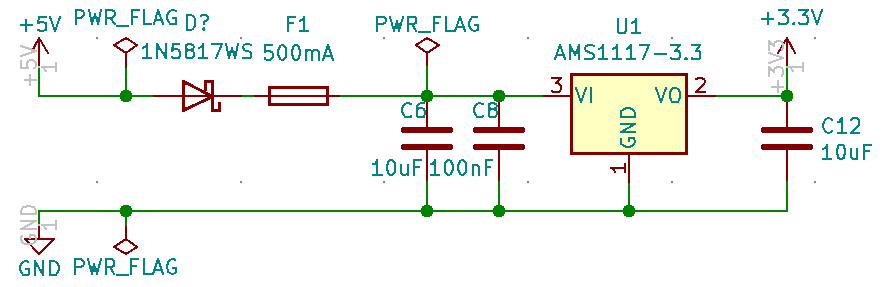


### USB circuit

Type-c interface is convenient to make the connection. Find information ([USB Type-C Configuration Channel (CC) pin function](https://kevinzhengwork.blogspot.com/2014/09/usb-type-c-configuration-channel-cc-pin.html )). It is known that for the c-to-c data line, the power supply of VBUS does not always exist, and the voltage is output only when the pull-down 5.1K resistance of the CC pin is detected at the host end. We need to connect a 5.1K resistor to ground in CC1 and CC2 respectively. For the a-to-c data line VBUS always exists, but the host needs to detect the device insertion through the pull-up resistor on D+/D-, and determine whether the device is a full speed device or a low speed device. STM32 is not able to process USB transactions as soon as it is powered on. It needs to wait for the initialization to complete, so the pull-up resistor needs to be controlled by a GPIO. The final USB interface circuit diagram of the STM32 end is as follows:

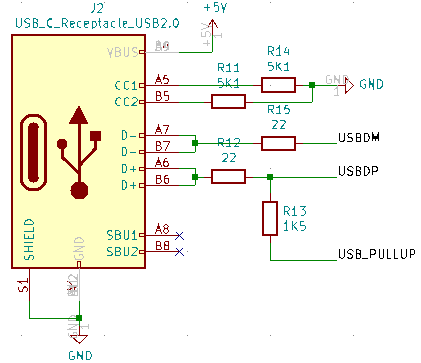

**Note**: If type-c is to detect the power supply capability, the accuracy of 5.1K resistance is required, see the following figure for details:

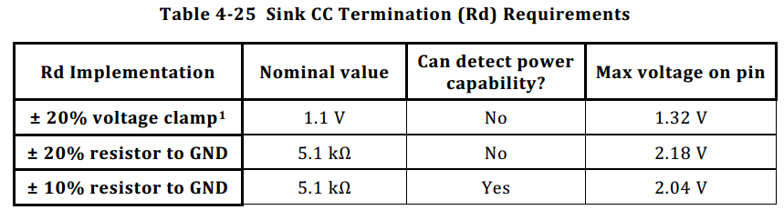

Serial programming needs to be implemented through a serial port, and a USB to serial port circuit is needed. [CH330N](https://datasheet.lcsc.com/szlcsc/Jiangsu-Qin-Heng-CH330N_C108996.pdf) is small in size and does not require an external crystal oscillator. The final serial port programming circuit is as follows:

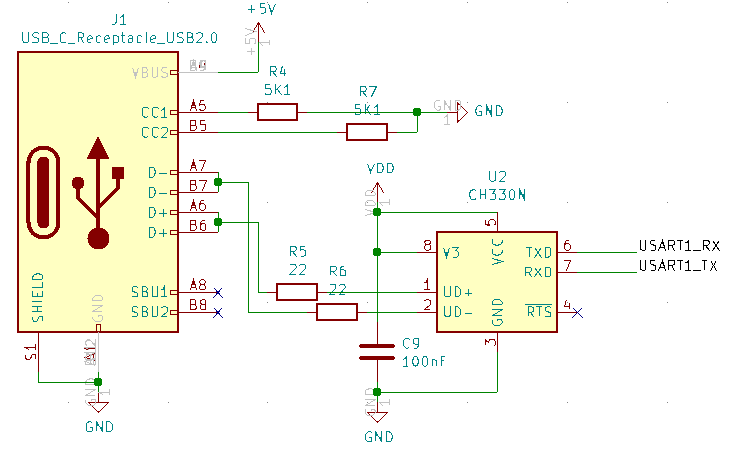


### Other

For STM32, we chose STM32F103C8T6 but some auxiliary circuits are needed: reset circuit, external crystal oscillator, and startup configuration.

The reset circuit is generally implemented by an RC circuit, and the charging time calculation can be found in [wikipedia](https://en.wikipedia.org/wiki/RC_time_constant). The final circuit is as follows:

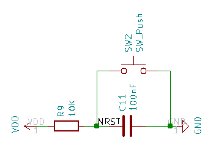

The external crystal oscillator used the passive ones. Passive crystal oscillators need to be matched with suitable capacitors to work. The choice of capacitance is related to a characteristic load capacitance of the crystal oscillator. The relationship is as follows: CL = (C1*C2)/(C1+C2) + Cstray.

* CL, load capacitance of the crystal oscillator
* C1/C2, the capacitance of the two capacitors that work with the crystal oscillator
* Cstray, equivalent capacitance of printed circuit and component pin

The final circuit is as follows:

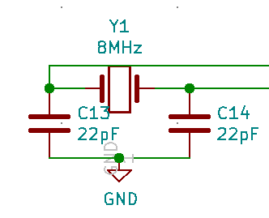

Start-up configuration, STM32 has two pins (BOOT0/BOOT1) for selecting where to start running when powering up, the startup method is as follows:

| BOOT0 | BOOT1 | BOOT Mode |
|-------|-------|-----------|
| x     | 0     | Main Flash Memory |
| 0     | 1     | System Memory (Used for serial programming) |
| 1     | 1     | Embedded SRAM (Used for Debug) |

The final startup configuration circuit is as follows:

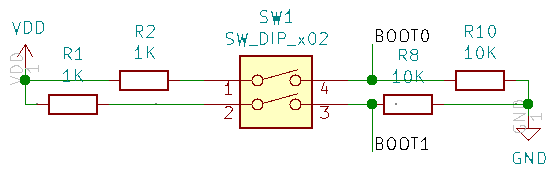


## Layout

Kicad can be routing through automated tools. What we need to do is:

* Determine how many layers to use
* Place related components close by
* Draw PCB physical boundaries
* Draw the wiring boundary of the PCB
* Export Spectra DSN
* Call freerouting for routing
* Save Specctra Session
* Import Specctra Session

For the use of freerouting, please refer to [Document](https://github.com/freerouting/freerouting/blob/master/README.md)


## Panelization of the boards

It's feasible make multiple smaller boards on the bigger ones by panelizing the PCB. The joints between the boards are specially processed, which is easier to divide later. Rails can be added around the boards for fixing during processing.

The work can be done through [kikit](https://github.com/yaqwsx/KiKit), kikit is a command line tool implemented by python3, installed by the following command:

```
pip3 install kikit
```

kikit supports two methods for the connection between the boards: vcut and stamp hole. vcut refers to a groove at the joint of the boards, which is suitable for square and rectangular boards, but not for irregular boards. Stamp hole (mouse bites), a series of continuous through holes are punched at the connection, the shape is similar to a stamp, so it is called a stamp hole, suitable for irregularly shaped boards.

The layout need to be completed before panelizing the PCB. Kikit can arrange multiple boards according to the order, add gaps between the boards, and add rails up and down or left and right after panelization. The main command line parameters used are as follows:

```
➜  ~ kikit panelize grid --help
Usage: kikit panelize grid [OPTIONS] INPUT OUTPUT

  Create a regular panel placed in a frame.

  If you do not specify the panelsize, no frame is created

Options:
  -s, --space FLOAT               Space between boards
  -g, --gridsize <INTEGER INTEGER>...
                                  Panel size <rows> <cols>
  -p, --panelsize <FLOAT FLOAT>...
                                  Add a frame to a panel. The argument
                                  specifies it size as <width> <height>
  --railsTb FLOAT                 Add bottom and top rail. Specify its
                                  thickness in mm
  --railsLr FLOAT                 Add left and right rail. Specify its
                                  thickness in mm
  --tabwidth FLOAT                Size of the bottom/up tabs, leave unset for
                                  full width
  --tabheight FLOAT               Size of the left/right tabs, leave unset for
                                  full height
  --htabs INTEGER                 Number of horizontal tabs for each board
  --vtabs INTEGER                 Number of vertical tabs for each board
  --vcuts                         Use V-cuts to separe the boards
  --vcutcurves                    Use V-cuts to approximate curves using
                                  starting and ending point
  --mousebites <FLOAT FLOAT FLOAT>...
                                  Use mouse bites to separate the boards.
                                  Specify drill size, spacing and offset from
                                  cutedge (use 0.25 mm if unsure)
  --radius FLOAT                  Add a radius to inner corners
  --rotation FLOAT                Rotate input board (in degrees)
  --sourcearea <FLOAT FLOAT FLOAT FLOAT>...
                                  x y w h in millimeters. If not specified,
                                  automatically detected
  --tolerance FLOAT               Include items <tolerance> millimeters out of
                                  board outline
  --renamenet TEXT                Rename pattern for nets. You can use '{n}'
                                  for board sequential number and '{orig}' for
                                  original net name
  --renameref TEXT                Rename pattern for references. You can use
                                  '{n}' for board sequential number and
                                  '{orig}' for original reference name
  --tabsfrom <TEXT FLOAT>...      Create tabs from lines in given layer. You
                                  probably want to specify --vtabs=0 and
                                  --htabs=0. Format <layer name> <tab width>
  --framecutV                     Insert vertical cuts through the frame
  --framecutH                     Insert horizontal cuts through the frame
  --copperfill / --nocopperfill   Fill unsed areas of the panel with copper
  --tooling <FLOAT FLOAT FLOAT>...
                                  Add tooling holes to corners of the panel.
                                  Specify <horizontalOffset> <verticalOffset>
                                  <diameter>.
  --fiducials <FLOAT FLOAT FLOAT FLOAT>...
                                  Add fiducials holes to corners of the panel.
                                  Specify <horizontalOffset> <verticalOffset>
                                  <copperDiameter> <openingDiameter>.
  --help                          Show this message and exit.
```


## Export positions of the component

During welding production, component position information is required. Open Kicad's pcb editor, click [File]->[Fabrication Outputs]->[Footprint Position(.pos) File...], and follow the prompts to output component positions. Position information includes: coordinates, layer, rotation angle.


## Production

### PCB and PCBA

PCB is a printed circuit board. The production mode can produce the PCB we draw in Kicad. After we get the board, we need to solder the components ourselves. PCBA (Printed Circuit Board + Assembly) is the finished PCB after SMT and DIP welding.

PCB price factors:

* Material cost: sheet material, sheet thickness, copper thickness (there is a calculator in Kicad that can calculate the ability of the circuit by wiring width and copper thickness)
* Process cost: wiring width, wiring spacing, surface treatment process (OSP anti-oxidation, lead spray tin, lead-free tin spray, gold plating, immersion gold, immersion tin, immersion silver, etc.), aperture, blind hole, buried hole

The price factor of PCBA:

* the cost is similar to the above but the soldering cost is related to the scales: A patch solder joint is about 0.01 CNY(~0.0015 USD), and a plug-in solder joint is 0.05 CNY(~0.0076 USD); small batch production will charge a process fee of 0-800 CNY(0 -- ~123 USD)


### First production

The production of two-layer PCB production is mature in Shenzhen. The price is about 30 CNY for 10 boards through the relative expensive business channel like TaobaoO. We didn't do the power protection circuit for the first prototyping but the 2nd batch.


### Second production

Power protection circuit was added in the 2nd prototyping. We inquiried a few providers via Taobao. The PCB assembly of 10 boards is about 300-800 CNY if you provide all materials( including PCB and components). If you need the other party prepares materials, it will add extra cost about 200-400 CNY.

- 2020.10.4 place an order
- 2020.10.13 material delivery
- 2020.10.25 received the board

In order to deep understanding the market. We did a little study which is make the PCBs at first and then went to manual soldering service in the electronic market. We received the PCB in 4 days since the order thanks to the mature supply chain eco-system. It cost ~50 CNY for each PCB board. You should choose manual welding service which is lower cost if you only intend to production in small scale. But we fucked up this time due to three boards had serious problem. CH340N was soldered in a very wrong way. Then we tried to solder CH340N from scratch. Unfortunately, only one of them can be detected but it was another problem with the USB D-pin connection. It poped a message that USB was inserted after the MCU started running but communication fails.

The SMT factory was not responsible for PCB assembly, so we sent 5 boards:

Final cost:
- PCB cost (10 boards): 67 CNY
- SMT welding(5 sets): 600 CNY
- Components (10 sets): 288 CNY
- Manual welding (3 boards): 150 CNY

The final machine welded 5 pieces, the cost per piece: 155.5
Finally, 3 pieces were manually welded, and the cost per piece: 85.5

Experience gained in this production:

* Should do better and effective communication with the factory.
* 0201 package is too small. 0603 is more convenient for manual welding.
* For small batch production, the cost of manual welding is low. It's necessary to find skilled welding workers, otherwise failure rate could be higher than expected.
* In some cases, SMT production need panelization. SMT machine is likely inefficient on small PCB production and may pose a challenge to fixtures. Talk to SMT factory about the detail before proceed to production.


### Third production

In order to facilitate manual soldering, a larger package (0603) resistance capacitor is used instead. This time, place an order through an online platform (jdbpcb.com), which provides prototying and SMT welding services. This platform needs to communicate with customer service through QQ, and the service is more professional than Taobao. Two boards failed in production.

The final cost of 10 boards is 164 CNY for prototyping, 330 CNY for SMT welding and 220 CNY for components. Final per piece cost: 71.4 CNY

One thing wasn't pleasant when using the platform this time: We placed an order for both PCBA and SMT at the same time but the checkout needs to be paid separately in two places. It misled us to believed that the platform was a low cost option.

Experience gained in this production:

* The number of layers has a great influence on the price
* Line width and line spacing are less than or equal to 5mil, and engineering fees will be charged
* For vias less than or equal to 0.25, engineering fees will be charged
* The thickness of the plate is less than or equal to 0.4 or greater than or equal to 2.0 will charge engineering fees


### Fourth production

The manual soldering pass rate of the second production is too low, and the cost is increased because the vias of the third production are too small. The utilization rate of the serial port programming circuit is very low, and there is no separate SWD programming debugging interface, so the connection is very troublesome. We changed the board : remove the serial port circuit, change the size of the vias, lead out more IO, switch to a single row of pins and add labels, switch to a pad package that is convenient for manual soldering. And order steel mesh, you can try manual SWD.

Manual SMD requires highly skills. Place the components as soon as possible after brushing the solder paste. Don't shake your hands when placing the components, otherwise the solder paste will be smeared and short-circuited.


### Fifth production

When working with flashrom as a flash reader, it's a bit of annoying to find out the pins according to PCB design. We added a 8-pin header to facilitate connection with SOP8 clips. Since the pins of regular spi flash have two common layouts(23/25/26 and 45 series), two 8-pin header have been added.

Total cost:
- PCB cost (10 pieces): 50 CNY
- SMD welding(10 sets): 330 CNY
- Components(10 sets): 340 CNY

Final per piece cost: 72

Experience in this production:

* Buying components from one supplier many times, the price will be too high, you can try to inquire other suppliers. The cost of the single-chip microcontroller has risen from 15 CNY to 20 CNY this time, which is 33.3% more expensive than last time.


### Sixth production

A circuit bug was found after the fifth production. The WP pin level control circuit did not add a current limiting resistor, which may cause a short circuit. This current revision has added the current limiting resistor. Due to the complexity of the onboard flash, the current version still faces the following problems:

* If the target board has low power and works at 3.3V, the main chip may work when the flash clip is clamped. There are two master on the spi bus, and strange problems occurs
* When the target board power is high, because the flash reader is powered by USB, the voltage of the reader will be pulled down and it will not work normally
* The target WP pin has a pull-down resistor, then it will be divided by our current limiting resistor, which may cause the device to be unable to write

The board that can be operated directly through the flash clip should have the following characteristics:

- There is a diode on the power pin to prevent current backflow
- If the WP pin has a pull-down resistor, the resistance value of the resistor should be larger. Refer to the flash datasheet for details

Total cost:
- PCB cost (10 pieces): 50 CNY
- SMD welding(10 sets): 530 CNY
- Components(10 sets): 300 CNY

Final per piece cost: 88

As the Spring Festival is approaching, labor increases, sellers no longer give discount, so the cost of SMD has risen a lot. The previous seller increased the price again so we chose to buy on Taobao. But the quantity required by the same seller on Taobao this time.

### Pictures of finished products

First version
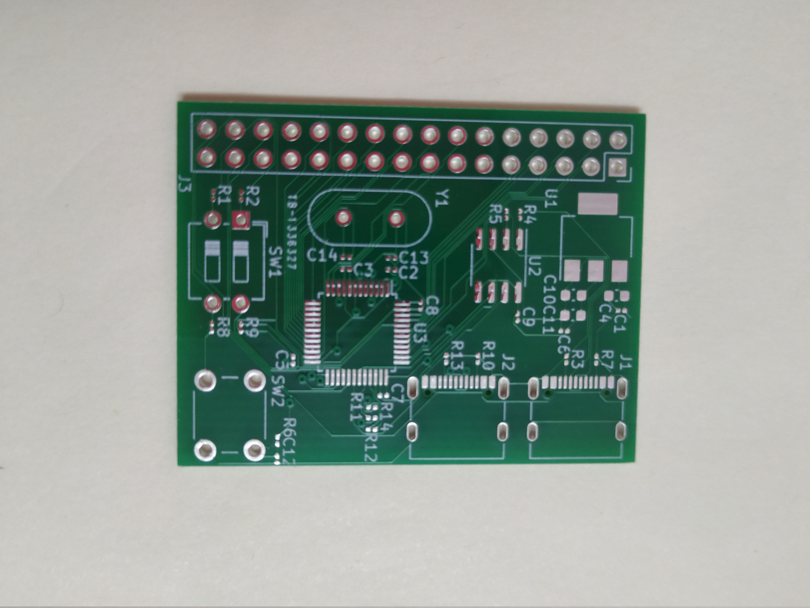

Second version
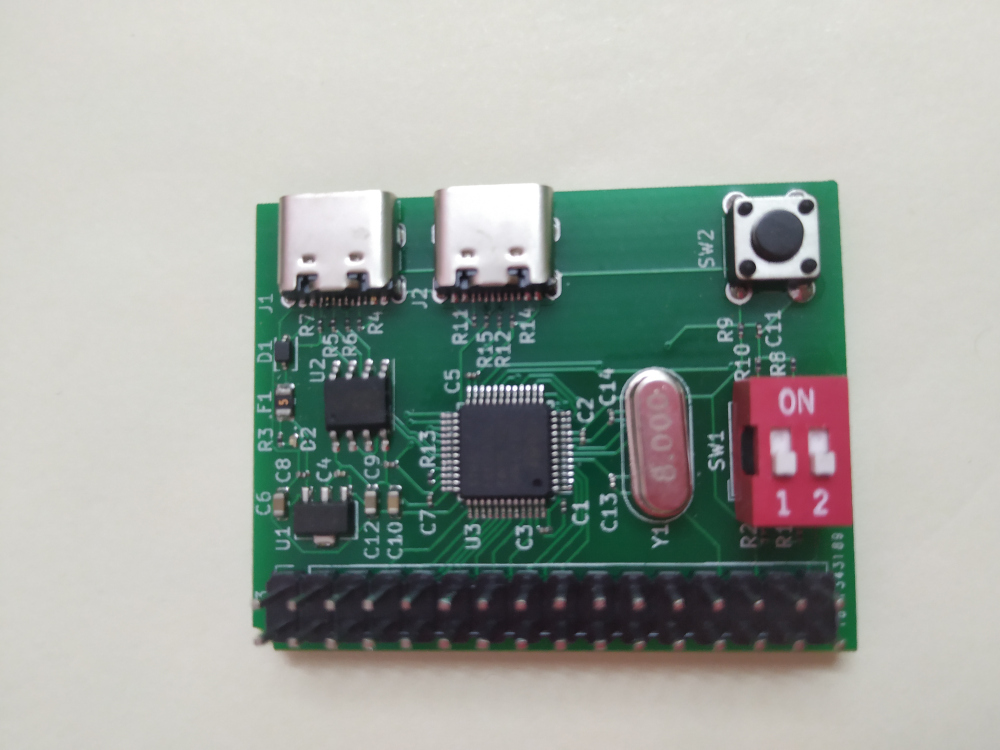

Third version
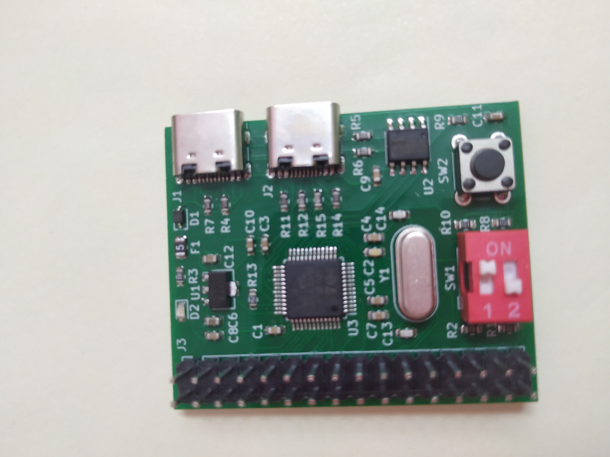

Fourth version
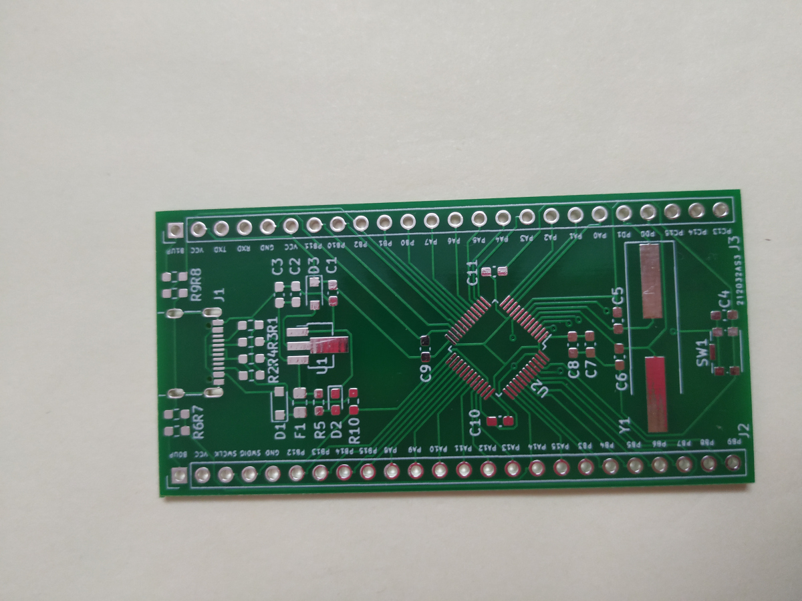

Fifth version
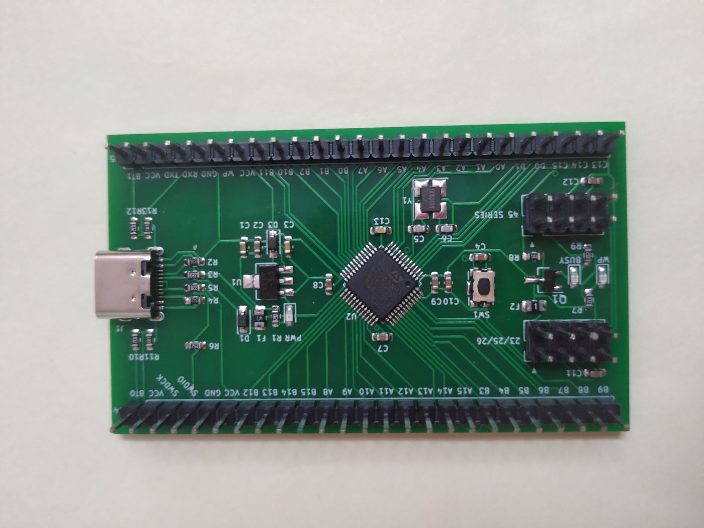

Sexth version
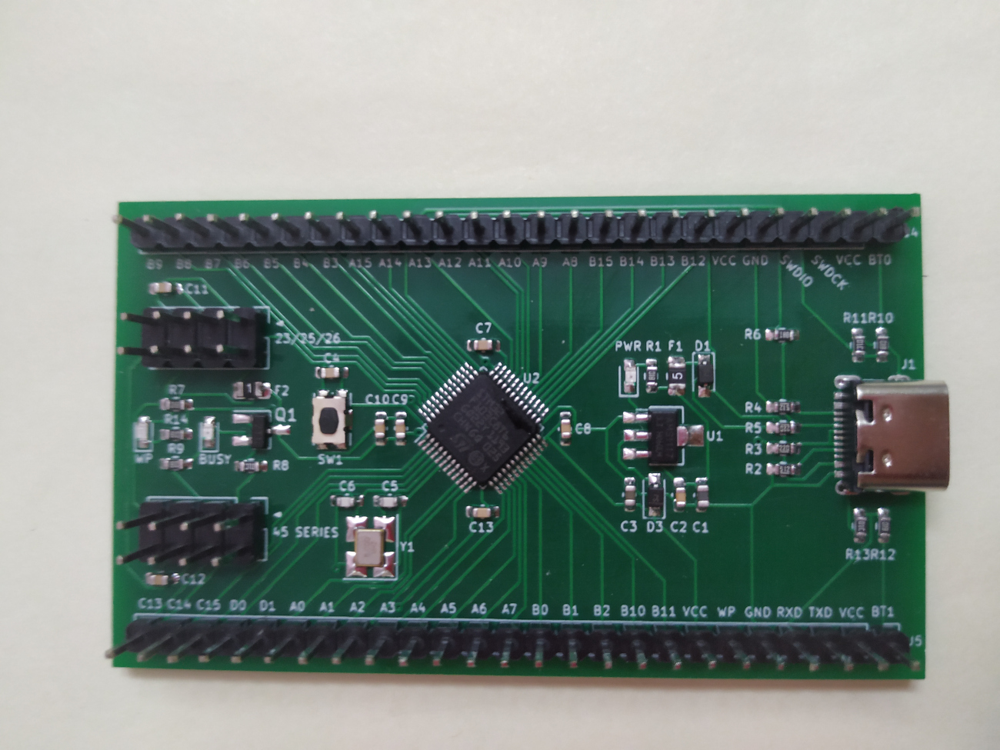

### Experience

* Multi-party inquiry! In the absence of quantity, the price you inquired about will be higher. The communication skill is important during the inquiry
* If there is no batch production, do not rely on a single supplier (price may rise)
* Distribution service needs to pay a little more cost which compare to buy the components seperately
* Choose the appropriate process (wiring width, wiring spacing, number of board layers, surface process, vias, blind vias, buried vias), it is best to check with the manufacturer before design
* For small batch production, you can choose to weld by yourself or find skilled workers to process, but you must pay attention to choosing people with reliable craftsmanship, otherwise the pass rate is terrible
* Avoid important local holidays, increase labor costs, and extend the construction period


## Supplies

| device                      | package         | quantity |
|-----------------------------|-----------------|----------|
| Capacitor 10uF              | 0603            | 2        |
| Capacitor 10nF              | 0603            | 1        |
| Capacitor 100nF             | 0603            | 8        |
| Capacitor 22pF              | 0603            | 2        |
| Schottky diodes 1N5817WS    | SOD-323         | 1        |
| light-emitting diode Red    | 0603            | 1        |
| light-emitting diode Blue   | 0603            | 1        |
| light-emitting diode Yellow | 0603            | 1        |
| Fuse 500mA                  | 0805            | 1        |
| Fuse 100mA                  | 0805            | 1        |
| USB C Receptacle            | Palconn UTC16-G | 1        |
| 2×4 2.54mm PinHeader        |                 | 2        |
| 1×25 2.54mm PinHeader       |                 | 2        |
| Transistor S9012            | SOT-23          | 1        |
| Resistor 1K                 | 0603            | 6        |
| Resistor 10K                | 0603            | 3        |
| Resistor 5.1K               | 0603            | 2        |
| Resistor 22                 | 0603            | 2        |
| Resistor 1K5                | 0603            | 1        |
| Button KMR241G              |                 | 1        |
| AMS1117-3.3                 | SOT-89          | 1        |
| STM32F103C8T6               | LQFP-48         | 1        |
| Crystal 8MHz                | SMD 3225        | 1        |
